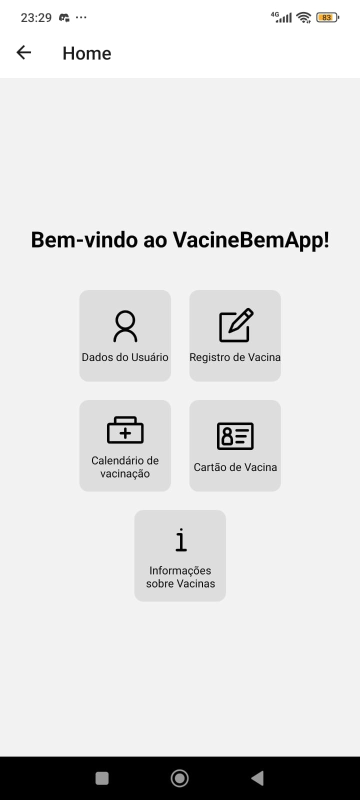
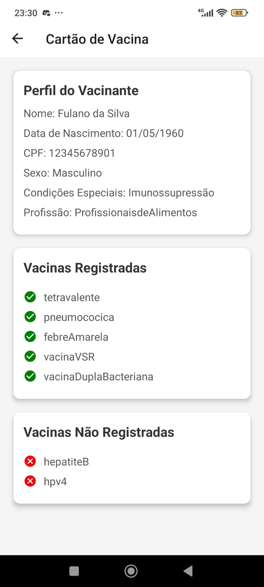
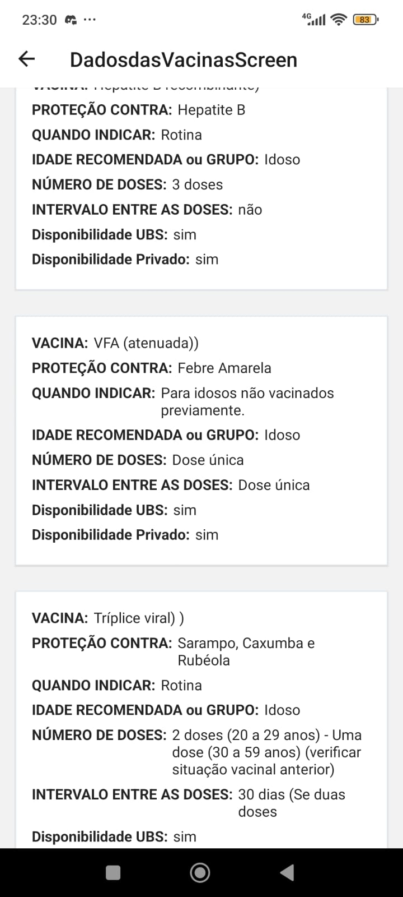
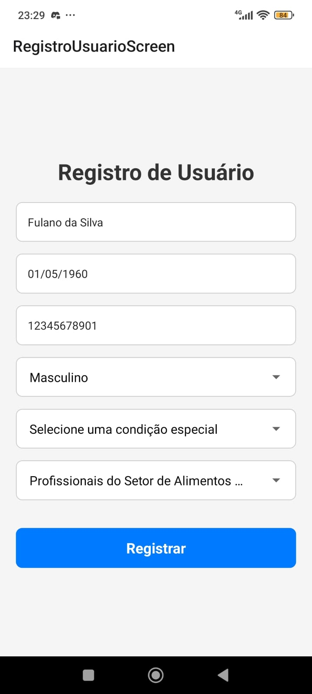
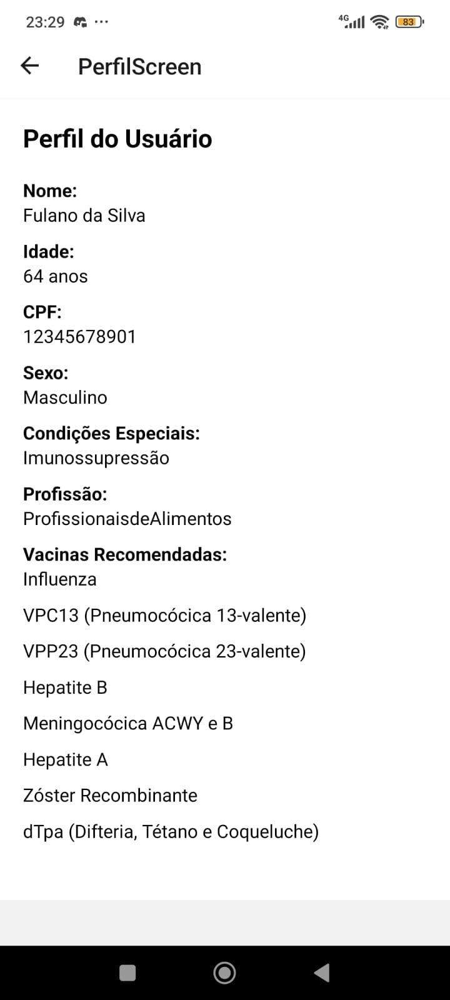
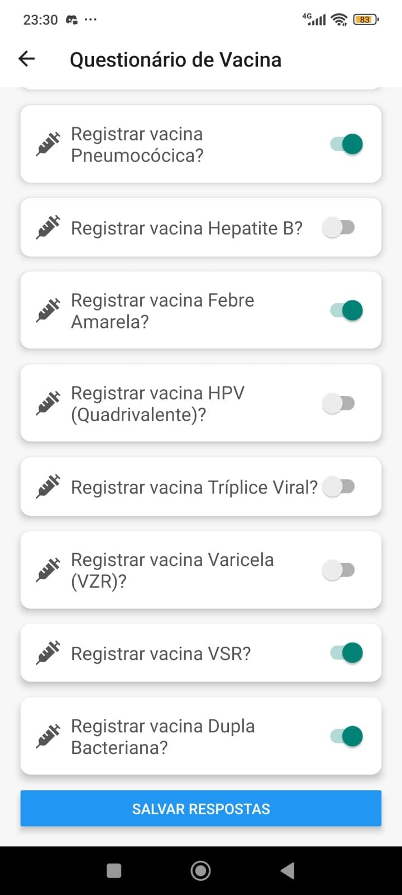
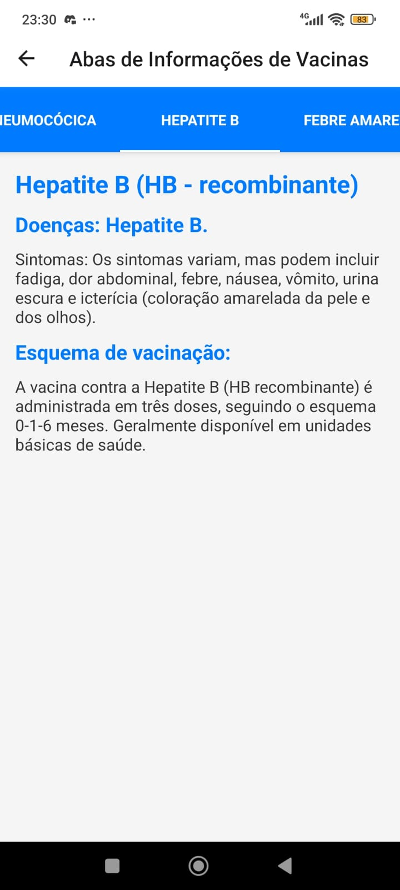

📱 VacineBem App:
APLICATIVO DE VACINAÇÃO PARA IDOSOS: MELHORANDO O ACESSO ÀS
VACINAS PREVENTIVAS
Um aplicativo desenvolvido como parte do meu Trabalho de Conclusão de Curso (TCC), com o objetivo de promover a vacinação e facilitar o gerenciamento de informações relacionadas à imunização.

🚀 Funcionalidades
Cadastro de Usuários: Permite o registro de informações pessoais, como nome, CPF, data de nascimento, profissão e condições de saúde.
Recomendações de Vacinas: Sugestões personalizadas com base nos calendários de vacinação da SBIm (Sociedade Brasileira de Imunizações) e do Calendário Técnico do Governo Federal.
Informações sobre Vacinas: Dados detalhados sobre cada vacina, incluindo nome, tipo de proteção, indicações, grupo recomendado, número de doses e intervalo entre elas.
Registro de Vacinas: Controle de vacinas já tomadas, com histórico atualizado.
Interface Intuitiva: Design simples e acessível para fácil navegação.

🛠️ Tecnologias
Frontend: React Native
Backend (planejado): Node.js com Express
Banco de Dados: Persistência de dados usando AsyncStorage (atualmente, local; backend em desenvolvimento)

📖 Como Utilizar
Pré-requisitos
Node.js
Expo CLI (para rodar o app)

📋 Roadmap
 Cadastro de usuários.
 Recomendação de vacinas com base em dados cadastrados.
 Tela de informações detalhadas sobre vacinas.
 Backend para sincronização de dados.
 Integração com APIs de saúde pública.

<!--alinharsImagens-->

